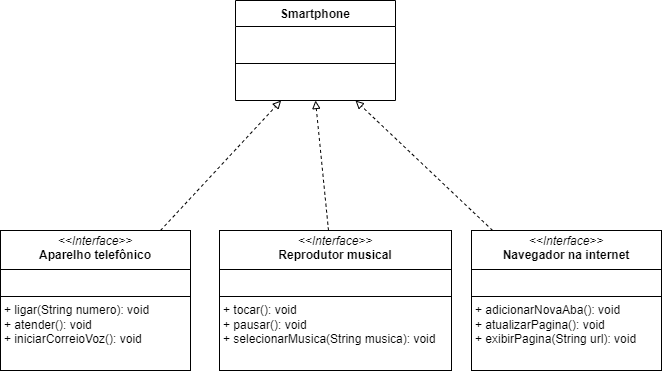

# Desafio DIO

### Modelagem e Diagramação de um Componente iPhone

Com base no [vídeo de lançamento do iPhone de 2007](https://www.youtube.com/watch?v=9ou608QQRq8), foi elaborada a diagramação das classes e interfaces utilizando a ferramenta UML [draw.io](https://www.drawio.com/) e implementadas as classes e interfaces no formato de arquivos .java.

O [desafio](https://github.com/digitalinnovationone/trilha-java-basico/tree/main/desafios/poo) foi proposto durante o Bootcamp GFT - Desenvolvimento Java com IA (2024) da plataforma [DIO](https://www.dio.me/).

#### Funcionalidades

1. **Reprodutor Musical**
   - Métodos: `tocar()`, `pausar()`, `selecionarMusica(String musica)`
2. **Aparelho Telefônico**
   - Métodos: `ligar(String numero)`, `atender()`, `iniciarCorreioVoz()`
3. **Navegador na Internet**
   - Métodos: `exibirPagina(String url)`, `adicionarNovaAba()`, `atualizarPagina()`

#### Diagrama UML

#### Conhecimentos aplicados

